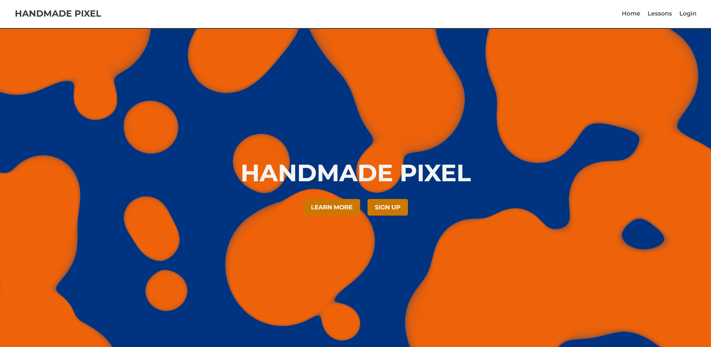
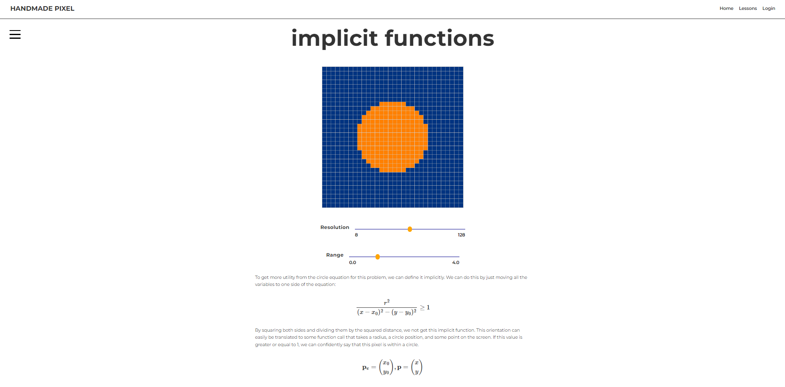

# Handmade-Pixel

This project is a website designed to host computer graphics tutorials, leveraging interactive and visually engaging content to enhance the learning experience. The backend is built in Rust, ensuring performance and reliability, while the frontend utilizes WebGPU for modern, high-performance graphics rendering.

At the core of the website are interactive graphical windows, powered by WebGPU, which run directly within the browser. These windows are created using a custom library called Handmade Renderer, which compiles to WebAssembly (WASM) for seamless integration into the webpage. Each interactive window serves as a dynamic learning tool, allowing users to experiment with and visualize key concepts in real time.

The website combines the power of Rust, WebAssembly, and WebGPU to deliver a unique educational platform for computer graphics. Whether you're a beginner or an experienced developer, this project aims to make learning graphics programming more intuitive, interactive, and enjoyable.

*Home page*

*Section of Metaball Lesson*

## Features
- Multiple webpages hosted on Rust server
- Customizable interactive windows using Handmade Renderer
- Account creation
- Email confirmation
- Metaball lesson

## Authors
- Alejandro Fernandez
- Sydney Lam

